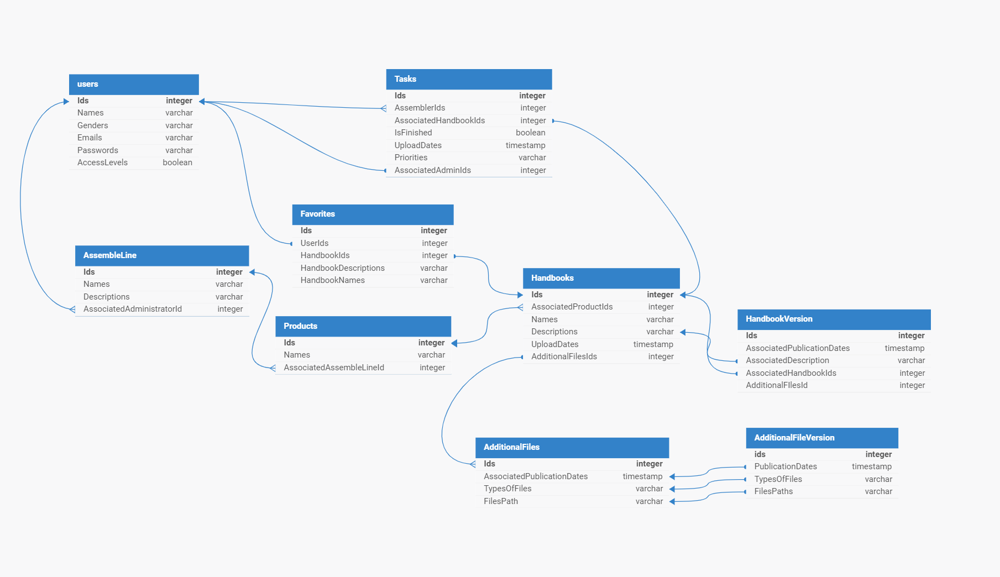

<h1 align="center">Modelagem do banco de dados da Plataforma da Dell</h1>
&nbsp;&nbsp;A Plataforma que será desenvolvida é uma aplicação web concebida para fornecer aos funcionários das linhas de montagem acesso fácil e eficiente a materiais técnicos e manuais de montagem de produtos da empresa, como computadores, servidores e notebooks. Essa plataforma permite que os funcionários estudem, revisem e acompanhem os processos de montagem de forma individualizada, mantendo-os atualizados sobre quaisquer alterações nos procedimentos ou inclusão de novos manuais.

&nbsp;&nbsp;O banco de dados foi desenvolvido utilizando a estrutura do Sistema de Gerenciamento de Banco de Dados (SGBD) PostgreSQL no software SQLDesigner. Após análises e discussões em várias reuniões com os parceiros, identificamos a necessidade de armazenar diversas informações que podem ser agrupadas em: usuários, manuais, tarefas, documentos, linhas de montagem, produtos, histórico de manuais, histórico de documentos adicionais aos manuais e favoritos. Isso nos forneceu uma base sólida para as entidades do nosso banco de dados, sabendo que estas serão continuamente refinadas à medida que a aplicação amadurece. Abaixo está o modelo físico, incluindo cardinalidade, nulabilidade e tipos de dados:



[Diagrama em PNG](assets/databaseDiagram.png)</br>
[Diagrama em PDF](assets/databaseDiagram.pdf)</br>
[Arquivo da Modelagem (XML)](assets/db.xml) 

## Relacionamentos
Claro, vou descrever as relações e cardinalidades com base nas tabelas fornecidas:

1. **users**:
   - Relações: Os usuários podem estar associados a várias tarefas (AssemblerIds e AssociatedAdminIds) e favoritos (UserIds).
   - Cardinalidade:
     - Um usuário pode ter muitas tarefas (1:N).
     - Um usuário pode ter muitos favoritos (1:N).

2. **Handbooks**:
   - Relações: Os manuais podem estar associados a várias tarefas (AssociatedHandbookIds) e favoritos (HandbookIds).
   - Cardinalidade:
     - Um manual pode estar em muitas tarefas (1:N).
     - Um manual pode ser favoritado por muitos usuários (1:N).

3. **Tasks**:
   - Relações: As tarefas podem estar associadas a um usuário que a monta (AssemblerIds), a um manual (AssociatedHandbookIds) e a um administrador (AssociatedAdminIds).
   - Cardinalidade:
     - Uma tarefa é montada por um usuário (N:1).
     - Uma tarefa está associada a um manual (N:1).
     - Uma tarefa é administrada por um usuário (N:1).

4. **Favorites**:
   - Relações: Os favoritos estão associados a um usuário (UserIds) e a um manual (HandbookIds).
   - Cardinalidade:
     - Um favorito é atribuído a um usuário (1:1).
     - Um favorito é de um manual (N:1).

5. **AssembleLine**:
   - Relações: As linhas de montagem podem estar associadas a um administrador (AssociatedAdministratorId).
   - Cardinalidade:
     - Uma linha de montagem está associada a um administrador (N:1).

6. **Products**:
   - Relações: Os produtos estão associados a uma linha de montagem (AssociatedAssembleLineId).
   - Cardinalidade:
     - Um produto está associado a uma linha de montagem (N:1).

7. **AdditionalFiles**:
   - Relações: Os arquivos adicionais estão associados a um manual (AssociatedPublicationDates).
   - Cardinalidade:
     - Um arquivo adicional está associado a um manual (N:1).

8. **HandbookVersion**:
   - Relações: As versões do manual estão associadas a um manual (AssociatedHandbookIds).
   - Cardinalidade:
     - Uma versão do manual está associada a um manual (N:1).


&nbsp;&nbsp; Estes relacionamentos são os pilares fundamentais que sustentam a estrutura do nosso banco de dados. Foram moldados a partir de uma profunda compreensão do negócio do nosso parceiro, obtida através de reuniões, análises de requisitos, orientações dos professores e deduções cuidadosas. Abaixo, apresentamos o código do banco de dados, já testado e funcional:

Código SQL:
```sql
DROP TABLE IF EXISTS HandbookVersion;
DROP TABLE IF EXISTS AdditionalFiles;
DROP TABLE IF EXISTS Products;
DROP TABLE IF EXISTS AssembleLine;
DROP TABLE IF EXISTS Favorites;
DROP TABLE IF EXISTS Tasks;
DROP TABLE IF EXISTS Handbooks;
DROP TABLE IF EXISTS users;


-- Tabela para armazenar informações dos usuários
CREATE TABLE users (
    Ids SERIAL PRIMARY KEY, -- Identificador único do usuário
    Names VARCHAR(100), -- Nome do usuário
    Genders VARCHAR(30), -- Gênero do usuário
    Emails VARCHAR(100), -- Email do usuário
    Passwords VARCHAR(60), -- Senha do usuário
    AccessLevels BOOLEAN -- Níveis de acesso do usuário
);

-- Tabela para armazenar informações dos manuais
CREATE TABLE Handbooks (
    Ids SERIAL PRIMARY KEY, -- Identificador único do manual
    AssociatedProductIds INTEGER REFERENCES Products(Ids), -- IDs dos produtos associados
    Names VARCHAR(100), -- Nome do manual
    Descriptions VARCHAR(200), -- Descrição do manual
    UploadDates TIMESTAMP, -- Data de upload do manual
    AdditionalFilesIds INTEGER REFERENCES AdditionalFiles(Ids), -- IDs de arquivos adicionais associados
    PublicationDates TIMESTAMP -- Data de publicação do manual
);

-- Tabela para armazenar informações das tarefas
CREATE TABLE Tasks (
    Ids SERIAL PRIMARY KEY, -- Identificador único da tarefa
    AssemblerIds INTEGER REFERENCES users(Ids), -- IDs dos usuários que montam as tarefas
    AssociatedHandbookIds INTEGER REFERENCES Handbooks(Ids), -- IDs dos manuais associados às tarefas
    IsFinished BOOLEAN, -- Indica se a tarefa está finalizada
    UploadDates TIMESTAMP, -- Data de upload da tarefa
    Priorities VARCHAR, -- Prioridades da tarefa
    AssociatedAdminIds INTEGER REFERENCES users(Ids) -- IDs dos administradores associados às tarefas
);

-- Tabela para armazenar informações dos favoritos
CREATE TABLE Favorites (
    Ids SERIAL PRIMARY KEY, -- Identificador único do favorito
    UserIds INTEGER REFERENCES users(Ids), -- IDs dos usuários que favoritam
    HandbookIds INTEGER REFERENCES Handbooks(Ids), -- IDs dos manuais favoritados
    HandbookDescriptions VARCHAR(200), -- Descrições dos manuais favoritados
    HandbookNames VARCHAR(100) -- Nomes dos manuais favoritados
);

-- Tabela para armazenar informações das linhas de montagem
CREATE TABLE AssembleLine (
    Ids SERIAL PRIMARY KEY, -- Identificador único da linha de montagem
    Names VARCHAR(100), -- Nome da linha de montagem
    Descriptions VARCHAR, -- Descrição da linha de montagem
    AssociatedAdministratorId INTEGER REFERENCES users(Ids) -- IDs dos administradores associados à linha de montagem
);

-- Tabela para armazenar informações dos produtos
CREATE TABLE Products (
    Ids SERIAL PRIMARY KEY, -- Identificador único do produto
    Names VARCHAR(100), -- Nome do produto
    AssociatedAssembleLineId INTEGER REFERENCES AssembleLine(Ids) -- IDs das linhas de montagem associadas ao produto
);

-- Tabela para armazenar informações de arquivos adicionais
CREATE TABLE AdditionalFiles (
    Ids SERIAL PRIMARY KEY, -- Identificador único do arquivo adicional
    AssociatedPublicationDates TIMESTAMP, -- Data de publicação associada ao arquivo adicional
    TypesOfFiles VARCHAR(100), -- Tipos de arquivos
    FilesPath VARCHAR(100) -- Caminho dos arquivos
);

-- Tabela para armazenar informações das versões do manual
CREATE TABLE HandbookVersion (
    Ids SERIAL PRIMARY KEY, -- Identificador único da versão do manual
    AssociatedPublicationDates TIMESTAMP REFERENCES Handbooks(PublicationDates), -- Data de publicação associada à versão do manual
    AssociatedHandbookIds INTEGER REFERENCES Handbooks(Ids) -- IDs dos manuais associados às versões
);
```